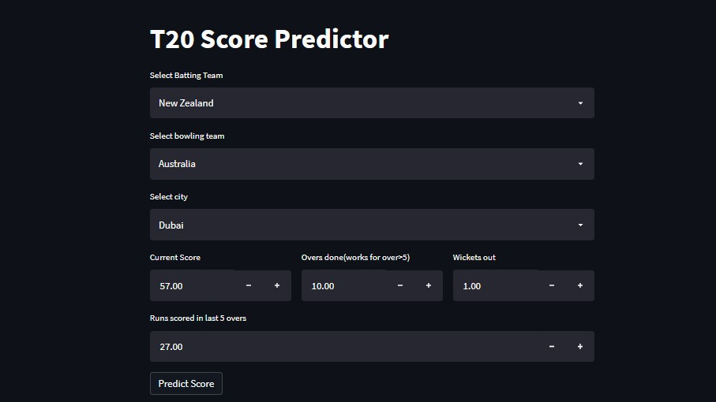
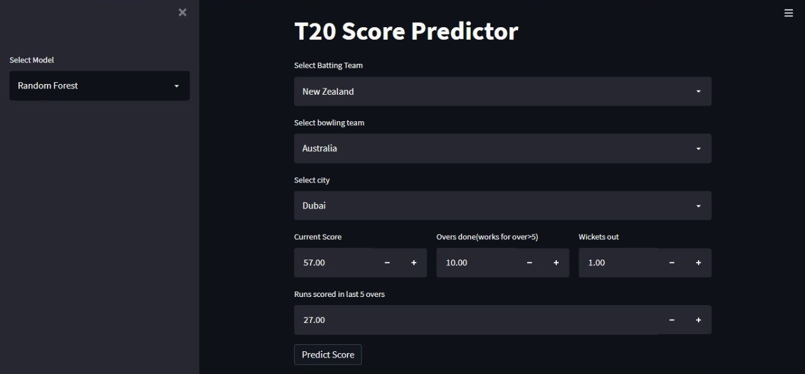
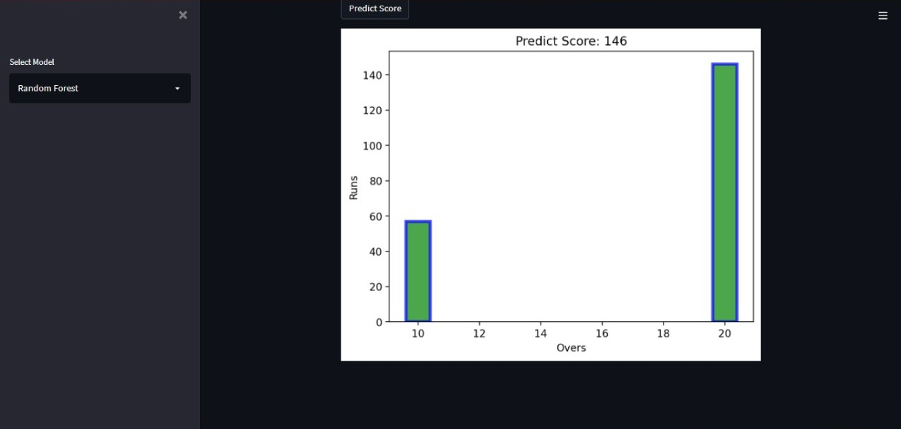
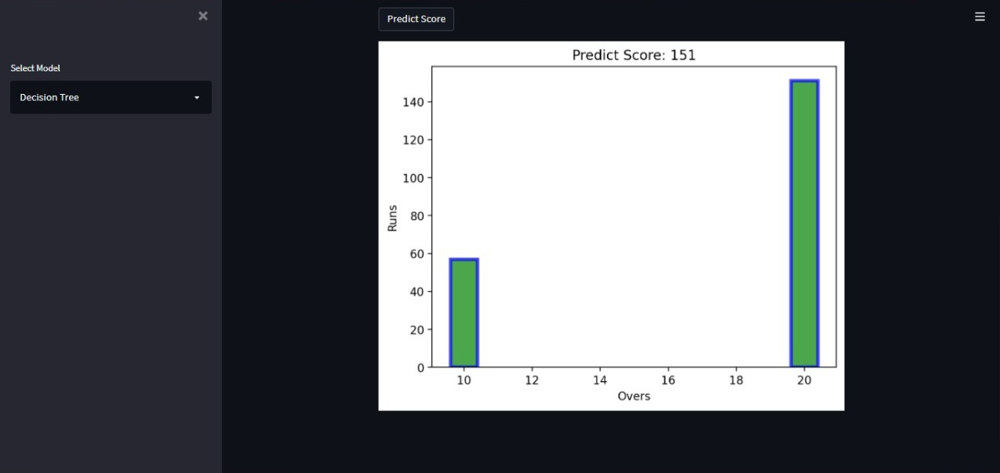
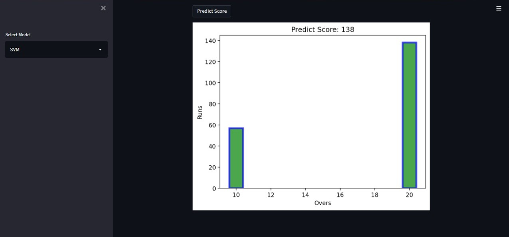

# Cricket Score Predictor

### Holds the Award of "BEST INNOVATIVE IDEA" on the Final Year Project Exhibition @FET University of Sindh

#### _Machine Learning based Cricket Score Predictor web app, that predicts the first innings score of a T20 Cricket Match. !!_

## For now it runs on localhost using streamlit and anaconda, not deployed yet

## Images

## Run Locally

- Run this command `git clone https://github.com/developer-junaid/Cricket-Score-Predictor.git`
- You are now in the dev environment and you can play around

## Tech Stack

- Python (Programming)
- NumPy (for data calculations)
- Pandas (for data filtering and analysis)
- Scikit-learn (To train machine learning models)
- matplotlib (To plot graph calculations)
- plotly (To develop graph on the UI)
- Streamlit (To develop Frontend)
